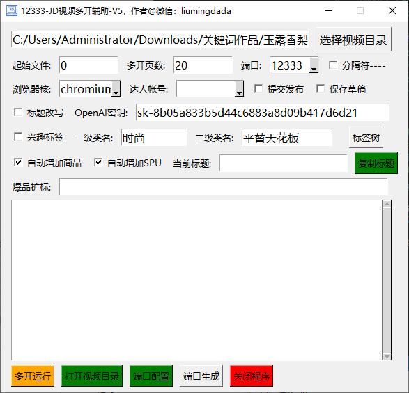

# jdvideopost
京东视频批量上传助手， 京东平台内视频发布工具

# 京东达人视频自动化批量发布工具  

## 🚀 工具简介  
专为京东达人、电商卖家和自媒体运营打造的自动化视频发布解决方案，通过模拟人工操作、多账号多开和AI智能优化，实现视频批量上传、商品关联和标签优化，大幅提升内容发布效率，降低运营成本。经实测，单账号单开软件60条视频最多只需要30分钟上传，多帐号多开比如3个帐号同时3开，30分钟 每个帐号都是60条，即共180条上传， 测试4开4号 40分钟上传240条无压力，拉验证码部分当前版本为手工验证，如果已产生2次验证的，可换IP后拉码1次验证即可 。  



## 🌟 核心功能亮点  

### 1. **全流程自动化操作**  
- **智能浏览器控制**：基于Playwright实现浏览器自动化，支持Chrome/Firefox/WebKit内核  
- **视频批量处理**：自动读取本地视频目录，按规则筛选并上传指定数量视频  
- **AI标题生成**：集成OpenAI、阿里云Qwen等模型，自动生成高转化率营销标题  
- **商品智能关联**：根据视频文件名提取SKU，自动关联京东商品链接及SPU列表  

### 2. **多账号多开高效运营**  
- **账号池管理**：支持批量导入达人账号，自动轮换登录  
- **多浏览器并行**：通过端口隔离技术实现20+浏览器同时运行  
- **会话保持**：记住账号登录状态，避免重复验证  

### 3. **精细化运营支持**  
- **标签智能匹配**：根据视频内容自动选择兴趣标签、体裁标签  
- **自定义参数配置**：支持标题扩展、标签层级、发布模式（草稿/发布）等参数自定义  
- **日志记录与复盘**：自动记录发布状态，支持失败视频重试  


## 📈 运营效益提升  

| 指标         | 人工操作         | 工具操作         | 提升幅度 |
|--------------|------------------|------------------|----------|
| 30分钟发布量  | 10-20条          | 60+条           | 5倍-20倍+  |


## 🛠️ 技术优势  

### 1. **智能模拟人工操作**  
- 随机延时策略：模拟人类操作节奏，避免被平台识别为机器人  
- 动态元素定位：自动适应京东达人后台界面更新  
- 异常处理机制：自动识别验证码、网络异常等场景并提示  

### 2. **AI驱动内容优化**  
- 标题改写：过滤促销信息，生成符合平台推荐机制的短标题  
- 标签优化：根据类目特性推荐高曝光标签组合  
- 商品匹配：优先选择高佣金、高销量商品  

### 3. **灵活可扩展架构**  
- 模块化设计：支持自定义插件扩展功能  
- 配置化运营：通过JSON/INI文件快速调整参数  
- 多环境兼容：Windows/macOS/Linux全平台支持  


## 📌 使用场景  

- **电商卖家**：批量发布商品带货视频，覆盖全品类推广  
- **MCN机构**：管理多达人账号，统一内容发布流程  
- **自媒体团队**：矩阵号运营，快速测试内容爆款潜力  
- **营销公司**：为客户提供一站式视频代运营服务  


## 🚦 快速启动指南  

1. **环境准备**  
   - 安装Python 3.8+、Playwright、OpenAI等依赖  
   - 配置Chrome浏览器远程调试端口  

2. **参数设置**  
   - 视频目录：指定本地视频存储路径  
   - 账号配置：导入达人账号密码  
   - 智能参数：设置AI标题生成、标签匹配规则  

3. **启动运行**  
   ```bash
   python 京东平台内视频发布V3.py
   ```  
   - 选择多开页数、浏览器端口等参数  
   - 点击"多开运行"开始自动化发布  


## 📞 服务支持  

- **技术交流**：微信：liumingdada 
- **定制开发**：支持功能定制  
- **更新服务**：持续适配京东后台界面及功能更新  


## 💡 客户评价  

> "用这个工具后，我们团队3个人的工作量现在1个人就能完成，每月节省人力成本1.2万元！"  
> —— 某3C类目TOP10达人团队  

> "AI标题生成功能特别实用，视频点击率平均提升40%，带货转化率提高25%。"  
> —— 美妆类目资深达人  
